# AC 2021/22

## Data mining

- Processo de identificar implicit, valid, novel (medido comparando com expected
  values), potentially useful (leva a ações uteis) and understandable;
- Encontrar padrões na data.

### KDD process

1. Cleaning and Integration;
2. Selection and Transformation;
3. Data Mining;
4. Evaluation and Presentation;
5. Knowledge;

### DM methodology

- Framework for recording experience => allows projects to be replicated;
- Aid to project planning and management;
- **Comfort factor** for new adopters => demonstra maturidade em Data Mining e
  reduz dependencia em "stars" (alguém que sabe tudo);
- Encoraja a best practices => better results.

#### CRISP-DM

- Non-proprietary framework para tornar data mining mais facil, rapido, e
  barato;
- App/Industry neutral;
- Tool neutral;
- Captura experiencia para poder ser reutilizado.

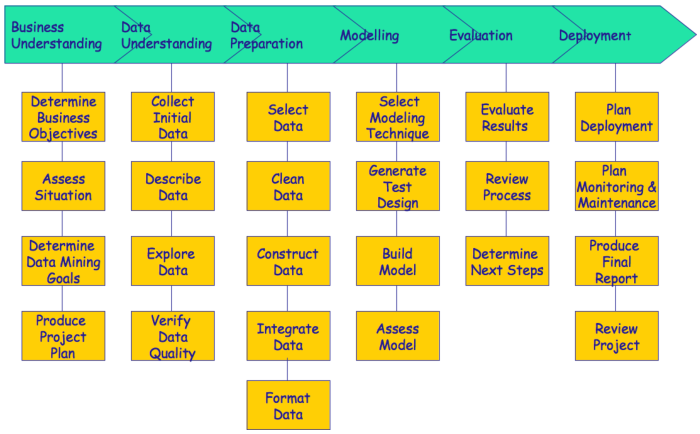

## Evaluate predictions

- Confusion matrix

| ------ | actual F | actual T |
| ------ | :------: | :------: |
| pred F |    TN    |    FN    |
| pred T |    FP    |    TP    |

- **Error rate** - percentage of cases where the model misses
  - $\frac{FP + FN}{TN + FN + FP + TP}$
- **Precision (PPV)** - $\frac{TP}{TP + FP}$
- **Recall (TPR)** - $\frac{TP}{TP + FN}$

## Decision trees

### Como construir

- Temos um set de examplos com labels:
  - O target indicate a class (sim/nao);
  - No nó raiz temos todas as classes.
- Se todos os exemplos estiverem na mesma class => parámos;
- Otherwise, dividimos o nó de forma a separar as classes:
  - Cada teste é do tipo: `type = value` ou `variable > value`.
- Criar nós descendentes de acordo com os testes selecionados;
- Repetir o processo para o set de exemplos em cada nó descendente.

### Entropy as diversity

- A entropia de um coin-flip é 1: H(X);
- Quanto maior o decrescimo de entropia numa decisão, melhor;
- **Information gain** - $IG(X) = H(Y) - H(Y|X)$
- Apenas splits entre exemplos de classes diferentes deve ser considerado.

### Overfitting

- Podemos ajustar o _minimum leaf size_;
- Decréscimo de training error não implica decréscimo de test error;
- Um modelo demasiado ajustado a dados de treino está overfitted => geralmente
  tem má generalização;

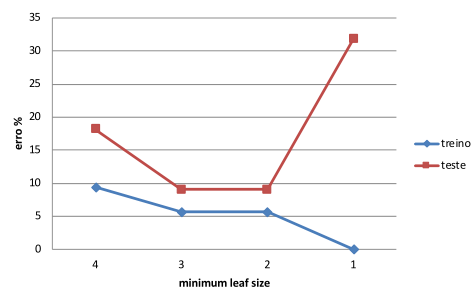

- Training error vai ser baixando, mas a partir de certo ponto, e de test
  aumenta.

### Classification como probabilidade

- Classificador atribui um prob. de uma entrada ser de uma class (para cada
  class);
- Onde fazemos o cut-off de confirmar que é ou nao?
  - Em binary decision, geralmente é na que tiver maior prob;
  - Pode ser um threshold arbitrario, e.g. 50%;
  - Pode depender dos sources available => pode ser misleading pk podemos ter
    uma grande quantidade de bad customers que não verifique na realidade.

## Data Preparation

1. Feature extraction;
2. Data cleaning;
3. Data transformation;
4. Feature engineering;
5. Data and dimensionality reduction.

- **Data** - coleção de objectos com atributos;
- **Atributo** - propriedade/caracteristica de um objeto:
  - **Categorical/Qualitative**:
    - **Nominal** - não há relações entre valores (e.g. name, gender);
    - **Ordinal** - há ordem entre valores (sem math possível) (e.g. size E
      {small, medium, large}).
  - **Numeric/Quantitative**:
    - **Discrete** - set finito de valores em que diferenças têm significado
      (e.g. temp, datas, duração de eventos);
    - **Continuous** - set infinito de valores absolutos (e.g. distancia,
      salário, nº de visitas ao hospital).
- **Objeto** - coleção de atributos;
- Objetos podem ter relações entre si.
- Tipos de data sets:
  - **Nondependency-oriented data**: objetos não têm deps entre si;
  - **Dependency-oriented data**: relações implicitas/explicitas entre objetos.

### Data Characteristics

- **Dimensionality** - nº de atributos. High dim traz dificuldades;
- **Sparsity**;
- **Resolution** - patterns dependem da scale;
- **Size** - tipos de análise podem depender do tamanha da data.

---

- **Data Wrangling** - Processo de transformar e mapear data para um formato
  trabalhavel em analise estatística;
- **Data Quality** - raw data (straight from real world) is bad:
  - values missing;
  - inconsistent across different data sources;
  - erroneous.

### Noise

- Refers to irrelevant/useless information;
- Caused by incorrect/distroted measurements;
- Pode também ser causada por variabilidade própria do domínio.

### Outliers

- Objectos com características consideravelemnte diferentes da maioria;
- Podem ser **noise** que interfere com a análise;
- Podem ser **o objetivo** da nossa análise => credit card fraud, intrusion
  detection.

### Missing Values

- **Missing Completely at Random (MCAR)**:
  - Missing values são independentes dos valor observados e dos não observados;
  - Não há nada de sistemático sobre eles;
  - E.g. lab value de uma sample mal processada.
- **Missing at Random (MAR)**:
  - Relacionados com data observada (não com a não observada);
  - Pode haver algo sistemático sobre ele;
  - E.g. missing income value may depende on age.
- **Missing Not at Random (MNAR)**:
  - Relacionado com unobserved data da variable;
  - **Informative/Non-ignorable missingness**;
  - E.e. a person did not enter their weight num survey.
- **Solutions:**
  - **Remove** - considerar apenas casos completos;
  - **Ignore** - ignorá-los na fase de análise => user métodos que funcionam de
    forma robusta com missing values;
  - **Make estimates (Imputation)** - Usar um método para gerar um valor para o
    que falta. E.g. mean, mode, baseado noutros atributos, modelos ML. Pode
    introduzir **bias que afetem o resultado**.

### Duplicates

- Data pode incluir objetos duplicados (ou quase duplicados);
  - Acontece muito quando se merge heterogeneous sources.
- E.g. mesma pessoa com múltiplos emails;
- Por vezes é desejável manter duplicados => oversampling.

### inconsistent or incorrect data

- Hard to detect => depende de domain knowledge;
- E.g. 4/11/2000 = Nov. 4th or April 11th?

### Feature extraction

- Extrair atributos da raw data para que análise seja possível;
- É application specific. E.g. sensor data, image data, etc...

### Data cleaning

- Making our data set tidy:
  - each value belongs to a var and observation;
  - each var contains all values of a certain property measured across all obs;
  - each obs contains all values of the variables measured for the respective
    case.
- Estas properties levam a tabelas:
  - cada row é uma obs;
  - cada coluna representa um atributo medido para cada obs.

#### Missing values

- Remover todos os casos com unknown value;
- Preencher unknowns com most common value (statistic de centrality);
- Preencher com most common value dos casos mais _similares_ ao unknown;
- Preencher com linear interpulation dos valores próximos (tempo ou espaço);
- Explorar correlação eventual entre variáveis;
- Fazer nada => alguns data mining methods trabalham com missing values de forma
  robusta.

#### Incorrect values

- **Inconsistency detection** - data integration techniques within the database
  field;
- **Domain knowledge** - data auditing;
- **Data-centric methods** - statistical-based methods para detetar outliers.

### Data transformation

- Mapear valores de attribute para replacements. Dá para identificar os valores
  de origem (não deixar nada para trás);
- Útil para lidar com escalas;

#### Normalization

- **Min-Max Scaling** - [0, 1] - Baseada no range. Não robusta contra outliers;
- **Standarization (z-score norm.)** - [-3, 3] - scaled de forma a que a
  **mean** seja 0 e a **standard deviation** seja 1;
- **Case dependent** - casos baseados em tempo usando técnicas diferentes, e.g.
  moving average, low-pass filter;

#### Binarization/One-Hot Encoding

- Alguns data mining methods não conseguem lidar com atributos numéricos;
- **Binarization** - Atributo categorico com 2 valores transformado em 1/0;
- **One-Hot Encoding** - Atributo categorico com k valores possíveis
  transformado k binary attributes;

#### Discretization

- Processo de converter var contínua em atributo numerico ordinal;
- Temos de encontrar quebras nos data values;
- Usar unsupervised (e.g. equal-width, equal-frequency) ou supervised methods.

### Feature engineering

- Usar domain knowledge para criar features que ajudem a resolver o problema;
- Atributos que capturem a informação important do dataset de forma mais
  eficiente;
- **Expressar relações conhecidas entre vars**:
  - criar ratios/proportions;
  - averages, means, modes...
- **Overcome limitations de DM tools**:
  - DM tools costumam dar shuffle aos **cases**;
  - Criar vars que expressem relações temporais (em vez de depender da ordem da
    tabela).
- **Time Delay Embedding** - criar variaveis cujo valor é o valor da mesma
  variável me passos anteriores => ajudaa visualização em algumas ferramentas.

## Data understanding

1. Data quality;
2. Data summarization;
3. Data visualization.

### Data Summarization

- Data sets grades tornam dificil saber o que se passa;
- Ajuda-nos a ver as propriedades chaves da data;
- Ajuda a selecionar ferramenta mais apropriada para a análise;
- Descreve propriedades importantes da distribuição dos valores.

#### Categorical vars

- **Mode** - valor mais frequente;
- **Frequency table** - frequencia de cada valor (absoluta ou relativa);
- **Contingency table** - frequencia de valores entre 2 variáveis.

#### Numeric vars

- **Mean** - sensível a extremos;
- **Median** - Valor em que 50% dos valores do data set estão acima e outros 50%
  abaixo;
- **Mode**;
- **Range** - $max - min$;
- **Variance** - sensível a extremos;
- **Standard deviation** - sensível a extremos;
- **IQR** - $Q3 - Q1$ - quartis são similares a **median** mas em 4 partes: Q1 é
  abaixo de 25% e Q3 é abaixo de 75%.

##### Outlier

Para um valor numerico, um **outlier** é um valor extremo. Na presença destes, a
**median** e a **mode** são mais robustas. O IQR é útil para análise da
variability => Numa **Boxplot**, qualquer valor **fora do IRQ é um outlier**.

##### Multivariate analysis of variability or dispersion

- **Covariance matrix** - variância entre cada par de valores numéricos =>
  **depende da magnitude** da variável;
- **Correlation matrix** - correlação entre cada par de valores numéricos => a
  **influência da magnitude é removida**.
  - **Pearson Correlation Coefficient** - [-1, +1] - mede a correlação linear
    entre 2 variáveis. 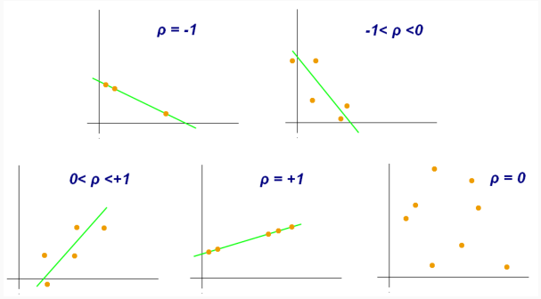
  - **Spearman Rank-Order Correlation Coefficient** - [-1, +1] - mede a força e
    direção da associação monotonica entre 2 variáveis. Variáveis podem estar
    relacionadas sem ser linearmente. 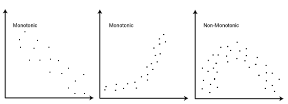

### Data Visualization

- Gráficos tornam a deteção de padrões mais facil => para os humanos;
- Também ajuda a detetar outliers como padrões estranhos;
- 3 tipos de gráficos: univariate, bivariate, multivariate/conditioned.

#### Univariate

- Categorical:
  - Barplots - frequência de ocorrência de valores de var categórica;
  - Piecharts - mesmo que barplots mas não muito úteis para comparações.
- Numeric:
  - Line plots - analisar evolução dos valores de uma variável contínua. Eixo x
    é uma scala de intervalos constantes. Frequente para análise temporal;
  - Histograms - mostrar distribuição de valores de uma variável contínua. Podem
    ser misleading em small datasets. Dependem do tamanho das bins. **Density
    estimation** para dar smooth;
  - QQ plots - comparação gráfica de propriedades como location, scale e
    skewness em 2 distribuiçoes. Pode ser usado para verificar visualmente a
    hipotese de uma variável seguir uma distribuição normal;
  - Boxplot - sumario da distribuição da variavel. Relacionadas com IQR.
    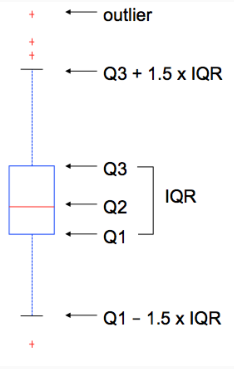.

#### Bivariate

- Scatterplot - natural graph para mostrar relação entre vars numericas;
- Parallel coordinates plot - atribute values para cada **case**. Ordem pode ser
  important para identificar grupos;
- Correlogram - correlation stats para cada par de vars (é um triangulo da
  matrix de correlacao);

#### Multivariate/Conditioned

- Para categorical vars;
- Conditioned Histograms;
- Conditioned Boxplots.

## Data reduction

Obter uma representação mais compacta do data set que **produz os mesmos
resultados analíticos**;

- Melhora visualization;
- Resultados mais interpretaveis;
- Mais rápido.
- **Curse of dimensionality** - Quando a dimensionalidade aumenta, a data
  torna-se mais esparsa. Distância e densidade de pontos torna-se menos
  significativa (**clustering dificil**).
  - O número de data points necessários para análise de padrões robusta cresce
    exponencialmente com o número de atributos.

### Agregação

- **PCA** - _n_ novos features => combinação linear de _n_ features já
  existentes;
- **ICA** - Ambos criam combinação linear de atributos. Assume que os atributos
  são estatísticamente independentes => reduz estatísticas de higher order (e.g.
  kurtosis). Não faz ranking de components;
- **Multidemensional scaling** - Projeção linear do data set. Usa distâncias
  entre pares de objetos (não os valores dos atributos). Bom quando é difícil
  extrair atributos relevantes para representar objetos.

## Feature selection

- **Redundant attributes** - informação duplicada em múltiplos atributos. E.g.
  data de nascimento e idade.
- **Irrelevant attributes** - não contêm info útil. E.g. ID's de alunos não
  ajudam a prever GPA.

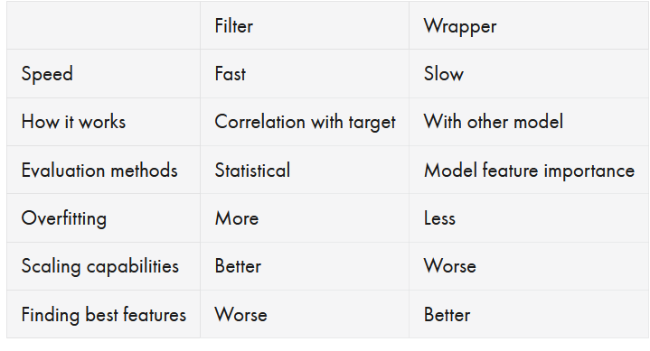

### Filter methods

- Com 2 attributos => remover redundante - E.g. correlação de Spearman/Pearson +
  pair plot;
- 1 atributo vs. target => identificar atributos relevantes - E.g. ANOVA +
  Chi-Square.

### Wrapper method

1. **Backward Elimination** - Começar com attributos todos => Ir removendo 1 de
   cada vez para ver se faz diferença;
2. **Forward Selection** - Começar sem atributos => Ir adicionando 1 de cada vez
   escolhendo os que dão maior increase.

## Unbalanced classes

- **Solutions:**
  - Collect more data;
  - Resample existing data - undersampling ou oversampling.
    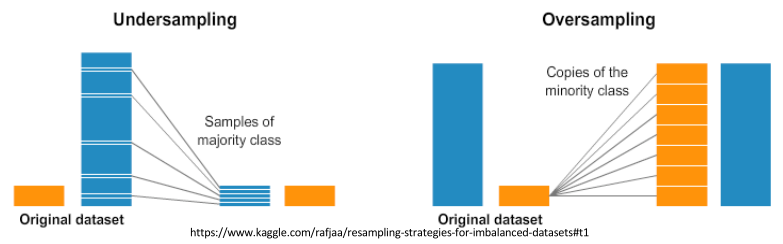;
  - Create synthetic data - **SMOTE** + **ADASYN**. Devemos split primeiro;
  - Adaptar learning algorithm - cost sensitive learning.

### Cost sensitive learning

- ML tentam minimizar FP+FN;
- Mas **FP e FN** costumam ter **impactos diferentes**, e.g. medical diagnostic
  (queremos mais FP do que FN);
- **Simple methods** - resampling e weighting according to costs;
- **Complex methods** - metacost.

#### Metacost

1. Criar replicas da train data;
2. Aprender model a partir de cada réplica;
3. Relabel examples;
4. Learn model on relabelled data.

Não depende do algoritmo.

## 6 Dimensions of data quality

1. **Completeness** - não faltar value não opcional;
2. **Consistency** - data sem contradições;
3. **Conformity** - info do mesmo tipo representada da mesma forma;
4. **Accuracy** - reflete a realidade;
5. **Integrity** - não ter orphaned records e toda a data na DB está relacionada
   com o resto;
6. **Timeliness** - dados recentes;

## Classifiers

### Simple linear classifier

- Linha a separar clusters de classes diferentes;
- De um lado é class1 e do outro é class2;
- Com 3+ classes, temos mais linhas de separação (2).

### Nearest Neighbor classifier

- Ver qual é o ponto mais próximo e copiar a sua class;
- **Dirichlet Tessellation** - As distâncias dividem (implicitamente) o espaço
  em regions belonging to an instance (tudo lá é 1 class);
- **Vantagens:**
  - Simples de implementar;
  - Handles correlated features;
  - Defined for any distance measure;
  - Handles streaming data trivially.
- **Desvantagens:**
  - **Sensível a irrelevant features**;
  - Slow para big datasets;
  - Funciona melhor para real valued dataset.

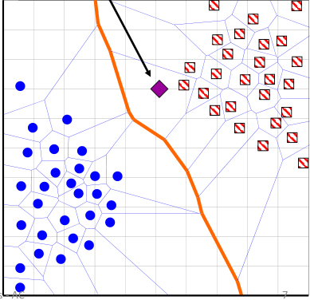

#### KNN algorithm

- Generalização no _nearest neighbor_;
- Encontrar as $K$ instancias mais próximas => cada uma é um voto;
- $K$ é tipicamente ímpar.

### Decision Tree classifier

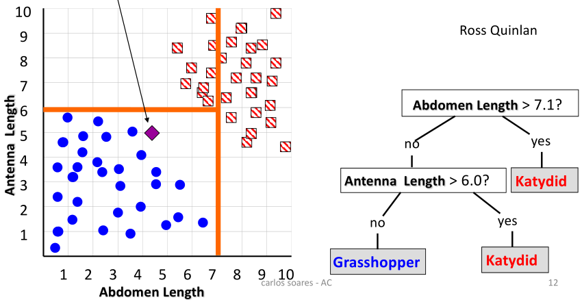

- Overfitting the train data:
  - Too many branches (refletem anomalias relacionadas com noise ou outliers);
  - Poor accuracy for unseen samples.
- Avoid overfitting:
  - Prepruning - halt node splitting;
  - Postpruning - sequencia of progressively pruned trees (remover branches de
    "fully grown" trees) => decidir a melhor num test set.
- **Vantagens:**
  - Facil de compreender;
  - Facil de gerar regras;
- **Desvantagens:**
  - Overfitting;
  - Does not handle correlated features well (rectangular partitioning);
  - Can be large => pruning necessary.

### Distribution as classifier

- More reliable with more data.

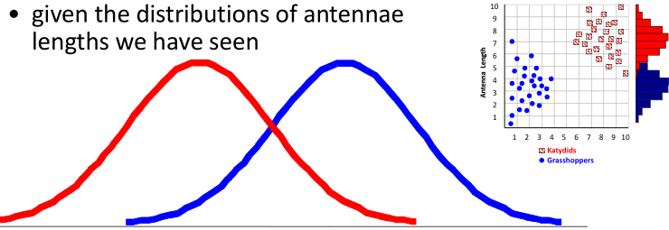

### Naive Bayes classifier

- **Bayes theorem** - $p(c_j|d) = \frac{p(d|c_j) * p(c_j)}{p(d)}$
  - Podemos ignorar o denominador (mesmo para todas as classes);
  - Probabilidade de ter feature d com alguma probabilidade sabendo que é class
    $c_j$ × frequencia de $c_j$ no data set;
  - Assumindo independencia, podemos só multiplicar $p(d1|c_j)$ × $p(d2|c_j)$...
    até n.
- **Vantagens:**
  - Fast - traino e classificacao;
  - Não é sensível a atributos irrelevantes;
  - Funciona real e discrete data;
  - Handles streaming data well.
- **Desvantagens:**
  - Assume independencia de features.

### SVM

- Linear learning machines que tentam maximizar margem => melhor separação de
  classes (**hyperplane**);
- **Duality** => higher robustness to the curse of dimensionality: **maximize**
  e **constraints**;
- **Kernel trick** => non-linear models;

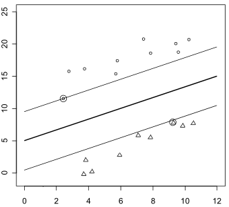

- Basta olhar para os pontos que definem a fronteira => o resto é irrelevante;
- **Vantagens:**
  - statistical learning theory => bounds to the generalization error based on
    the training error;
  - results independent of initial consitions (ordem dos examplos e
    inicializações);
  - convex problem - no local minima => reduz probabilidade de overfitting;
  - **dual** é independent do número de atributos => minimiza efeito da curse of
    dimensionality.

#### Problemas não linears

- Em High-dimensional space é mais provável um problema ser linearmente
  separável do que em low-dimensional space;
- Podemos mudar o **kernel** => problema projetado numa higher dimension;
- **Regularization constant, C** - trade-off entre a importância da margem e do
  erro => **soft margin** (maximize margin e minimize error).
