# AC 2021/22

## Data mining

- Processo de identificar implicit, valid, novel (medido comparando com expected
  values), potentially useful (leva a ações uteis) and understandable;
- Encontrar padrões na data.

### KDD process

1. Cleaning and Integration;
2. Selection and Transformation;
3. Data Mining;
4. Evaluation and Presentation;
5. Knowledge;

### DM methodology

- Framework for recording experience => allows projects to be replicated;
- Aid to project planning and management;
- **Comfort factor** for new adopters => demonstra maturidade em Data Mining e
  reduz dependencia em "stars" (alguém que sabe tudo);
- Encoraja a best practices => better results.

#### CRISP-DM

- Non-proprietary framework para tornar data mining mais facil, rapido, e
  barato;
- App/Industry neutral;
- Tool neutral;
- Captura experiencia para poder ser reutilizado.

## Evaluate predictions

- Confusion matrix

| ------ | actual F | actual T |
| ------ | :------: | :------: |
| pred F |    TN    |    FN    |
| pred T |    FP    |    TP    |

- **Error rate** - percentage of cases where the model misses
  - $\frac{FP + FN}{TN + FN + FP + TP}$
- **Precision (PPV)** - $\frac{TP}{TP + FP}$
- **Recall (TPR)** - $\frac{TP}{TP + FN}$

## Decision trees

### Como construir

- Temos um set de examplos com labels:
  - O target indicate a class (sim/nao);
  - No nó raiz temos todas as classes.
- Se todos os exemplos estiverem na mesma class => parámos;
- Otherwise, dividimos o nó de forma a separar as classes:
  - Cada teste é do tipo: `type = value` ou `variable > value`.
- Criar nós descendentes de acordo com os testes selecionados;
- Repetir o processo para o set de exemplos em cada nó descendente.

### Entropy as diversity

- A entropia de um coin-flip é 1: H(X);
- Quanto maior o decrescimo de entropia numa decisão, melhor;
- **Information gain** - $IG(X) = H(Y) - H(Y|X)$
- Apenas splits entre exemplos de classes diferentes deve ser considerado.

### Overfitting

- Podemos ajustar o _minimum leaf size_;
- Decréscimo de training error não implica decréscimo de test error;
- Um modelo demasiado ajustado a dados de treino está overfitted => geralmente
  tem má generalização;

- Training error vai ser baixando, mas a partir de certo ponto, e de test
  aumenta.

### Classification como probabilidade

- Classificador atribui um prob. de uma entrada ser de uma class (para cada
  class);
- Onde fazemos o cut-off de confirmar que é ou nao?
  - Em binary decision, geralmente é na que tiver maior prob;
  - Pode ser um threshold arbitrario, e.g. 50%;
  - Pode depender dos sources available => pode ser misleading pk podemos ter
    uma grande quantidade de bad customers que não verifique na realidade.

## Data Preparation

1. Feature extraction;
2. Data cleaning;
3. Data transformation;
4. Feature engineering;
5. Data and dimensionality reduction.

- **Data** - coleção de objectos com atributos;
- **Atributo** - propriedade/caracteristica de um objeto:
  - **Categorical/Qualitative**:
    - **Nominal** - não há relações entre valores (e.g. name, gender);
    - **Ordinal** - há ordem entre valores (sem math possível) (e.g. size E
      {small, medium, large}).
  - **Numeric/Quantitative**:
    - **Discrete** - set finito de valores em que diferenças têm significado
      (e.g. temp, datas, duração de eventos);
    - **Continuous** - set infinito de valores absolutos (e.g. distancia,
      salário, nº de visitas ao hospital).
- **Objeto** - coleção de atributos;
- Objetos podem ter relações entre si.
- Tipos de data sets:
  - **Nondependency-oriented data**: objetos não têm deps entre si;
  - **Dependency-oriented data**: relações implicitas/explicitas entre objetos.

### Data Characteristics

- **Dimensionality** - nº de atributos. High dim traz dificuldades;
- **Sparsity**;
- **Resolution** - patterns dependem da scale;
- **Size** - tipos de análise podem depender do tamanha da data.

---

- **Data Wrangling** - Processo de transformar e mapear data para um formato
  trabalhavel em analise estatística;
- **Data Quality** - raw data (straight from real world) is bad:
  - values missing;
  - inconsistent across different data sources;
  - erroneous.

### Noise

- Refers to irrelevant/useless information;
- Caused by incorrect/distroted measurements;
- Pode também ser causada por variabilidade própria do domínio.

### Outliers

- Objectos com características consideravelemnte diferentes da maioria;
- Podem ser **noise** que interfere com a análise;
- Podem ser **o objetivo** da nossa análise => credit card fraud, intrusion
  detection.

### Missing Values

- **Missing Completely at Random (MCAR)**:
  - Missing values são independentes dos valor observados e dos não observados;
  - Não há nada de sistemático sobre eles;
  - E.g. lab value de uma sample mal processada.
- **Missing at Random (MAR)**:
  - Relacionados com data observada (não com a não observada);
  - Pode haver algo sistemático sobre ele;
  - E.g. missing income value may depende on age.
- **Missing Not at Random (MNAR)**:
  - Relacionado com unobserved data da variable;
  - **Informative/Non-ignorable missingness**;
  - E.e. a person did not enter their weight num survey.
- **Solutions:**
  - **Remove** - considerar apenas casos completos;
  - **Ignore** - ignorá-los na fase de análise => user métodos que funcionam de
    forma robusta com missing values;
  - **Make estimates (Imputation)** - Usar um método para gerar um valor para o
    que falta. E.g. mean, mode, baseado noutros atributos, modelos ML. Pode
    introduzir **bias que afetem o resultado**.

### Duplicates

- Data pode incluir objetos duplicados (ou quase duplicados);
  - Acontece muito quando se merge heterogeneous sources.
- E.g. mesma pessoa com múltiplos emails;
- Por vezes é desejável manter duplicados => oversampling.

### Inconsistent or incorrect data

- Hard to detect => depende de domain knowledge;
- E.g. 4/11/2000 = Nov. 4th or April 11th?

### Feature extraction

- Extrair atributos da raw data para que análise seja possível;
- É application specific. E.g. sensor data, image data, etc...

### Data cleaning

- Making our data set tidy:
  - each value belongs to a var and observation;
  - each var contains all values of a certain property measured across all obs;
  - each obs contains all values of the variables measured for the respective
    case.
- Estas properties levam a tabelas:
  - cada row é uma obs;
  - cada coluna representa um atributo medido para cada obs.

#### Missing values

- Remover todos os casos com unknown value;
- Preencher unknowns com most common value (statistic de centrality);
- Preencher com most common value dos casos mais _similares_ ao unknown;
- Preencher com linear interpulation dos valores próximos (tempo ou espaço);
- Explorar correlação eventual entre variáveis;
- Fazer nada => alguns data mining methods trabalham com missing values de forma
  robusta.

#### Incorrect values

- **Inconsistency detection** - data integration techniques within the database
  field;
- **Domain knowledge** - data auditing;
- **Data-centric methods** - statistical-based methods para detetar outliers.

### Data transformation

- Mapear valores de attribute para replacements. Dá para identificar os valores
  de origem (não deixar nada para trás);
- Útil para lidar com escalas;

#### Normalization

- **Min-Max Scaling** - [0, 1] - Baseada no range. Não robusta contra outliers;
- **Standarization (z-score norm.)** - [-3, 3] - scaled de forma a que a
  **mean** seja 0 e a **standard deviation** seja 1;
- **Case dependent** - casos baseados em tempo usando técnicas diferentes, e.g.
  moving average, low-pass filter;

#### Binarization/One-Hot Encoding

- Alguns data mining methods não conseguem lidar com atributos numéricos;
- **Binarization** - Atributo categorico com 2 valores transformado em 1/0;
- **One-Hot Encoding** - Atributo categorico com k valores possíveis
  transformado k binary attributes;

#### Discretization

- Processo de converter var contínua em atributo numerico ordinal;
- Temos de encontrar quebras nos data values;
- Usar unsupervised (e.g. equal-width, equal-frequency) ou supervised methods.

### Feature engineering

- Usar domain knowledge para criar features que ajudem a resolver o problema;
- Atributos que capturem a informação important do dataset de forma mais
  eficiente;
- **Expressar relações conhecidas entre vars**:
  - criar ratios/proportions;
  - averages, means, modes...
- **Overcome limitations de DM tools**:
  - DM tools costumam dar shuffle aos **cases**;
  - Criar vars que expressem relações temporais (em vez de depender da ordem da
    tabela).
- **Time Delay Embedding** - criar variaveis cujo valor é o valor da mesma
  variável me passos anteriores => ajudaa visualização em algumas ferramentas.

## Data understanding

1. Data quality;
2. Data summarization;
3. Data visualization.

### Data Summarization

- Data sets grades tornam dificil saber o que se passa;
- Ajuda-nos a ver as propriedades chaves da data;
- Ajuda a selecionar ferramenta mais apropriada para a análise;
- Descreve propriedades importantes da distribuição dos valores.

#### Categorical vars

- **Mode** - valor mais frequente;
- **Frequency table** - frequencia de cada valor (absoluta ou relativa);
- **Contingency table** - frequencia de valores entre 2 variáveis.

#### Numeric vars

- **Mean** - sensível a extremos;
- **Median** - Valor em que 50% dos valores do data set estão acima e outros 50%
  abaixo;
- **Mode**;
- **Range** - $max - min$;
- **Variance** - sensível a extremos;
- **Standard deviation** - sensível a extremos;
- **IQR** - $Q3 - Q1$ - quartis são similares a **median** mas em 4 partes: Q1 é
  abaixo de 25% e Q3 é abaixo de 75%.

##### Outlier

Para um valor numerico, um **outlier** é um valor extremo. Na presença destes, a
**median** e a **mode** são mais robustas. O IQR é útil para análise da
variability => Numa **Boxplot**, qualquer valor **fora do IRQ é um outlier**.

##### Multivariate analysis of variability or dispersion

- **Covariance matrix** - variância entre cada par de valores numéricos =>
  **depende da magnitude** da variável;
- **Correlation matrix** - correlação entre cada par de valores numéricos => a
  **influência da magnitude é removida**.
  - **Pearson Correlation Coefficient** - [-1, +1] - mede a correlação linear
    entre 2 variáveis. 
  - **Spearman Rank-Order Correlation Coefficient** - [-1, +1] - mede a força e
    direção da associação monotonica entre 2 variáveis. Variáveis podem estar
    relacionadas sem ser linearmente. 

### Data Visualization

- Gráficos tornam a deteção de padrões mais facil => para os humanos;
- Também ajuda a detetar outliers como padrões estranhos;
- 3 tipos de gráficos: univariate, bivariate, multivariate/conditioned.

#### Univariate

- Categorical:
  - Barplots - frequência de ocorrência de valores de var categórica;
  - Piecharts - mesmo que barplots mas não muito úteis para comparações.
- Numeric:
  - Line plots - analisar evolução dos valores de uma variável contínua. Eixo x
    é uma scala de intervalos constantes. Frequente para análise temporal;
  - Histograms - mostrar distribuição de valores de uma variável contínua. Podem
    ser misleading em small datasets. Dependem do tamanho das bins. **Density
    estimation** para dar smooth;
  - Cumulative Distribution Function (CDF) - CDF of a random variable.
  - QQ plots - comparação gráfica de propriedades como location, scale e
    skewness em 2 distribuiçoes. Pode ser usado para verificar visualmente a
    hipotese de uma variável seguir uma distribuição normal;
  - Boxplot - sumario da distribuição da variavel. Relacionadas com IQR.
    .

#### Bivariate

- Scatterplot - natural graph para mostrar relação entre vars numericas;
- Parallel coordinates plot - atribute values para cada **case**. Ordem pode ser
  important para identificar grupos;
- Correlogram - correlation stats para cada par de vars (é um triangulo da
  matrix de correlacao);

#### Multivariate/Conditioned

- Para categorical vars;
- Conditioned Histograms;
- Conditioned Boxplots.

## Data reduction

Obter uma representação mais compacta do data set que **produz os mesmos
resultados analíticos**;

- Melhora visualization;
- Resultados mais interpretaveis;
- Mais rápido.
- **Curse of dimensionality** - Quando a dimensionalidade aumenta, a data
  torna-se mais esparsa. Distância e densidade de pontos torna-se menos
  significativa (**clustering dificil**).
  - O número de data points necessários para análise de padrões robusta cresce
    exponencialmente com o número de atributos.

### Agregação

- **PCA** - _n_ novos features => combinação linear de _n_ features já
  existentes;
- **ICA** - Ambos criam combinação linear de atributos. Assume que os atributos
  são estatísticamente independentes => reduz estatísticas de higher order (e.g.
  kurtosis). Não faz ranking de components;
- **Multidemensional scaling** - Projeção linear do data set. Usa distâncias
  entre pares de objetos (não os valores dos atributos). Bom quando é difícil
  extrair atributos relevantes para representar objetos.

## Feature selection

- **Redundant attributes** - informação duplicada em múltiplos atributos. E.g.
  data de nascimento e idade.
- **Irrelevant attributes** - não contêm info útil. E.g. ID's de alunos não
  ajudam a prever GPA.

### Filter methods

- Com 2 attributos => remover redundante - E.g. correlação de Spearman/Pearson +
  pair plot;
- 1 atributo vs. target => identificar atributos relevantes - E.g. ANOVA +
  Chi-Square.

### Wrapper method

1. **Backward Elimination** - Começar com attributos todos => Ir removendo 1 de
   cada vez para ver se faz diferença;
2. **Forward Selection** - Começar sem atributos => Ir adicionando 1 de cada vez
   escolhendo os que dão maior increase.

## Unbalanced classes

- **Solutions:**
  - Collect more data;
  - Resample existing data - undersampling ou oversampling.
    ;
  - Create synthetic data - **SMOTE** + **ADASYN**. Devemos split primeiro;
  - Adaptar learning algorithm - cost sensitive learning.

### Cost sensitive learning

- ML tentam minimizar FP+FN;
- Mas **FP e FN** costumam ter **impactos diferentes**, e.g. medical diagnostic
  (queremos mais FP do que FN);
- **Simple methods** - resampling e weighting according to costs;
- **Complex methods** - metacost.

#### Metacost

1. Criar replicas da train data;
2. Aprender model a partir de cada réplica;
3. Relabel examples;
4. Learn model on relabelled data.

Não depende do algoritmo.

## 6 Dimensions of data quality

1. **Completeness** - não faltar value não opcional;
2. **Consistency** - data sem contradições;
3. **Conformity** - info do mesmo tipo representada da mesma forma;
4. **Accuracy** - reflete a realidade;
5. **Integrity** - não ter orphaned records e toda a data na DB está relacionada
   com o resto;
6. **Timeliness** - dados recentes;

## Classifiers

### Simple linear classifier

- Linha a separar clusters de classes diferentes;
- De um lado é class1 e do outro é class2;
- Com 3+ classes, temos mais linhas de separação (2).

### Nearest Neighbor classifier

- Ver qual é o ponto mais próximo e copiar a sua class;
- **Dirichlet Tessellation** - As distâncias dividem (implicitamente) o espaço
  em regions belonging to an instance (tudo lá é 1 class);
- **Vantagens:**
  - Simples de implementar;
  - Handles correlated features;
  - Defined for any distance measure;
  - Handles streaming data trivially.
- **Desvantagens:**
  - **Sensível a irrelevant features**;
  - Slow para big datasets;
  - Funciona melhor para real valued dataset.

#### KNN algorithm

- Generalização no _nearest neighbor_;
- Encontrar as $K$ instancias mais próximas => cada uma é um voto;
- $K$ é tipicamente ímpar.

### Decision Tree classifier

- Overfitting the train data:
  - Too many branches (refletem anomalias relacionadas com noise ou outliers);
  - Poor accuracy for unseen samples.
- Avoid overfitting:
  - Prepruning - halt node splitting;
  - Postpruning - sequencia of progressively pruned trees (remover branches de
    "fully grown" trees) => decidir a melhor num test set.
- **Vantagens:**
  - Facil de compreender;
  - Facil de gerar regras;
- **Desvantagens:**
  - Overfitting;
  - Does not handle correlated features well (rectangular partitioning);
  - Can be large => pruning necessary.

### Distribution as classifier

- More reliable with more data.

### Naive Bayes classifier

- **Bayes theorem** - $p(c_j|d) = \frac{p(d|c_j) * p(c_j)}{p(d)}$
  - Podemos ignorar o denominador (mesmo para todas as classes);
  - Probabilidade de ter feature d com alguma probabilidade sabendo que é class
    $c_j$ × frequencia de $c_j$ no data set;
  - Assumindo independencia, podemos só multiplicar $p(d1|c_j)$ × $p(d2|c_j)$...
    até n.
- **Vantagens:**
  - Fast - traino e classificacao;
  - Não é sensível a atributos irrelevantes;
  - Funciona real e discrete data;
  - Handles streaming data well;
  - No hiper-parametros.
- **Desvantagens:**
  - Assume independencia de features.

### SVM

- Linear learning machines que tentam maximizar margem => melhor separação de
  classes (**hyperplane**);
- **Duality** => higher robustness to the curse of dimensionality: **maximize**
  e **constraints**;
- **Kernel trick** => non-linear models;

- Basta olhar para os pontos que definem a fronteira => o resto é irrelevante;
- **Vantagens:**
  - statistical learning theory => bounds to the generalization error based on
    the training error;
  - results independent of initial consitions (ordem dos examplos e
    inicializações);
  - convex problem - no local minima => reduz probabilidade de overfitting;
  - **dual** é independent do número de atributos => minimiza efeito da curse of
    dimensionality.

#### Problemas não linears

- Em High-dimensional space é mais provável um problema ser linearmente
  separável do que em low-dimensional space;
- Podemos mudar o **kernel** => problema projetado numa higher dimension;
- **Regularization constant, C** - trade-off entre a importância da margem e do
  erro => **soft margin** (maximize margin e minimize error).

## Regression

### Linear regression

- Eq.: $y = f(x) = b_0 + b_1 * x$
- $b_0$ - interseção da linha com o eixo dos y. Muitas vezes **difícil de
  interpretar**;
- Assume que as variáveis não estão correlated:
  - Influência de cada variável é explicada separadamente;
  - Coefficients não são influênciados por mudar o set de explanatory variables
    (attributes).
- Variação depende do grau de correlação.

#### Estimar parametros

$b_1$ e $b_0$ estimados.

- $\widehat{b_1} = \frac{S_{XY}}{S_{XX}}$
  - $S_{XY} = \sum [(X_i - \overline{X}) * (Y_i - \overline{Y})]$
  - $S_{XX} = \sum (X_i - \overline{X})^2$
  - $\widehat{b_1}$ deve ser significativamente estisticamente diferente de
    **0**: para haver diferença (significativa) entre Y e X.
- $\widehat{b_0} = \overline{Y} - \widehat{\beta} * \overline{X}$
  - Pode ou não ser estatisticamente diferente de **0**;
  - Evidencia de quando $Y \neq 0$, $X = 0$;
  - Pode fazer sentido ser 0 => Valor de um cliente com 0 income;
  - Ou não => vendas mínimas de um produto que não tem shelf space.

#### Assumptions

- Relação entre X e Y é linear (e aditiva);
- Erros (e.g. unexplained variation in y):
  - Independently and identically distributed;
  - Homoscedasticity - constant variance;
  - Normally distributed.

#### Prediction and evaluation

- Dado x, o modelo estima y com $\widehat{y} = b_0 + b_1 * x$
- Mas estimativa não é perfeita;
- **Erro** - $\widehat{y} - y$
  - y - true value;
  - $\widehat{y}$ - value estimated by the model.
- **Mean error** - **não usar**;
- **Mean absolute error** - estima erro "tipíco";
- **Mean squared error** - dar mais peso a erros maiores;
  - Pode ser dominado por um conjunto de pequeno de casos.
- Erro **depende da escala** da target variable.

#### Baseline

- **Modelo trivial** - $\widehat{y_i} = \overline{y}$
  - Demos predict com a média.
- Regressão só é útil se o erro obtido for menor que o obtido com o **modelo
  trivial** (e.g. comparar os 2 com o **mean squared error**)
  - $\frac{\sum (\widehat{y_i} - y_i)^2}{\sum (\overline{y} - y_i)^2}$
  - 0 - regression model é perfeito;
  - (0, 1) - é útil;
  - 1 - equivalente ao modelo trivial;
  - `>1` - pior que o modelo trivial.

### Other algorithms

- KNN - como para classification:
  - Predict é o average dos target values (instead of majority voting).
- Decision trees:
  - Split criterio based on the sum of variances;
  - Prediction é o average of targets in the leaf (instead of majority voting).
- SVM:
  - Minimizar o "tubo à volta" dos dados (em vez de maximizar a distância até ao
    exemplo mais próximo de cada class).

### Bias-variance

- **Bias** - é o modelo que um algoritmo aprende dado um set de training data;
- **Variance** - é um modelo que um algorithm consegue aprender com **small
  changes** nos dados de treino;
- **Low bias => high variance** (e vice-versa) - Low bias são menos complexos;
- Queremos um modelo com bom trade-off (não demasiado complexo mas com bom
  predictive power).

## Descriptive modeling

### Similarity measure

- Está relacionado com a noção de **distância entre observações**;
- Pode ser visto como o oposto da distância;
- Medida numérica do quão similares são 2 data objects - [0,1];
- É mais alta quanto mais parecidos são os objetos;

#### Dissimilarity measure

- Quão diferentes são 2 objetos;
- Numérico. Minimo é 0, máximo varia;
- Pode ser expresso como uma métrica de distância, $d$, com certar propriedades:
  - $d(x_i, x_j) >= 0$
  - $d(x_i, x_j) = 0$ apenas se $x_i = x_j$
  - $d(x_i, x_j) = d(x_j, x_i)$
  - **Triangle inequality** - $d(x_i, x_j) <= d(x_i, x_k) + d(x_k, x_j)$
- Dist. metrics:
  - **Euclidean dist** - deixa de ser burro;
  - **Manhattan dist** - grelha;
  - **Minkowski/Chebyschev/Supremum dist** - distância num tabuleiro de chess.

---

- **Proximity** - refere-se a similarity ou dissimilarity.

#### Heterogeneous distance functions

- Distância entre 2 data objects é o sumatório das distância para cada atributo;
- Se o attributo for categórico:
  - 0 - $x_i^a == x_j^a$
  - 1 - otherwise
- Se o attributo for numérico:
  - $\frac{|x_i^a - x_j^a|}{|max_a - min_a|}$

#### General coefficient of Similarity

- $s(x_i, x_j)$
- Atributos podem ter um weight associado (entre 0 e 1);
- $s(x_i, x_j) = 1$ se $x_i = x_j$
- $s(x_i, x_j) = s(x_j, x_i)$

### Clustering

- Usa a noção de similaridade;
- Types of methods:
  - **Partitional** - dividir observações em k partições de acordo um critério;
  - **Hierachical** - generar uma hierarquia de grupos, de 1 a n groups, onde n
    é o número de linhas no data set.

#### Partitional methods

- Partition para k groups minimizando/maximizando um criterion;
- Dificuldades:
  - Selecionar o número de grupos;
  - O número de divisões possíveis cresce muito.
- **Cluster compactness** - o quão similares são os cases num cluster;
- **Cluster separation** - o quão distante dos outros clusters está um cluster;
- **Objetivo** - **minimizar intra-cluster distance** e **maximizar
  inter-cluster distances**;
- Clustering solution:
  - **Hard clustering** - objeto pertence a um cluster;
  - **Fuzzy clustering** - cada objeto tem uma probabilidade de pertencer a cada
    cluster;
- **Centroid** - median of the data objects in the cluster: **Sum of Squared
  Errors (SSE)**, **L1 measure**.

##### K-Means

Método para obter k groups do data set.

- Inicializar os centros de k grupos para um set de observations aleatórias;
- Repeatir até os grupos ficarem estáveis:
  - Allocate each obs to the group whose center is nearest;
  - Re-calculate the center of each group.
- Observações:
  - Usar squared Euclidean distance como critério;
  - Maximizar inter-cluster dissimilarity.
- Advantages:
  - Fast algorithm that scales well;
  - Stochastic approach that frequently works well. Tende a identificar local
    minima.
- Disadvantages:
  - Não garante optimal clustering;
  - Podemos obter soluções diferentes usando starting points diferentes;
  - O initial guess de k para o número de clusters pode estar longe do
    verdadeiro valor ótimo de k.

##### Cluster validation

- Types of Evaluation measures:
  - **Supervised** - comparar o clustering obtido com informação externa
    disponível;
  - **Unsupervised** - tenta medir a qualidade do clustering sem nenhuma
    informação do clustering ideal:
    - **Cohesion coefficients** - determinar o quão compacts/cohesive são os
      membros de um grupo;
    - **Separation coefficients** - determinar o quão diferentes são os membros
      de diferentes grupos.

- **Silhouette Coefficient** (unsupervised measure):
  - Incorpora as noções de cohesion e separation;
  - Obter a avg. dist. para todos os objetos no mesmo grupo;
  - Para cada outro grupo (a que objeto não pertence), calcular a avg. dist. até
    aos membros desses grupos => obter a mínima dessas distâncias;
  - O silhouette coefficiente, si, varia em [-1, 1].
- Calcular o avg. silhouette coeff para vários valores de k e escolher o que dá
  maior valor.

##### Cluster validation - best number of clusters, k

- Escolher mal leva a clustering mau;
- Idealmente deviamos ter a priori knowledge da estrutura real da data;
- Se n tivermos esse knowledge, começamos com $\sqrt{n/2}$ onde n é o número de
  atributos;
- **Elbow method** - Calcular the **within-cluster SSE** (**distortion**) e
  escolher k tal que adicionar um novo cluster não dá um SSE muito menor.

##### Other methods

- **Partition Around Medoids (PAM)**:
  - Procura k objetos representativos (medoid);
  - Cada obs. é alocada ao nearest medoid (como no k-means);
  - É mais robusto à presença de outliers por não usar averages;
  - Usa uma métrica mais robusta para medir a clustering quality.
- **Clustering Large Applications (CLARA)**:
  - Vantages de PAM sobre k-means tem custo computacional => pode ser demasiado
    para large data sets;
  - CLARA tenta resolver isto usando sampling => trabalha em partes do data set;

K-means like methods falham para os seguintes casos:

- **Density-Based Spatial Clustering of Applications with Noise (DBSCAN)**:
  - Densidade de uma obs. é estimada com o número de obs. que estão num raio
    (parámetro do método);
  - **Core points** - nº de obs. no raio está acima de um threshold;
  - **Border points** - nº de obs. não chega à threshold mas estão no raio de um
    **core point**;
  - **Noise points** - não tem obs. suficientes perto nem estão no raio de um
    **core point**.
  - **Advantages**:
    - Lida clusters de diferentes shapes e sizes;
    - Resistente a noise.
  - **Disadvantages**:
    - Varying densities;
    - High-dimensional data.

#### Hierachical clustering

- Cada nível representa uma solução com x grupos;
- User seleciona a solução que quer;
- **Dendogram** pode ser usado para visualização.
- **Agglomerative methods** - bottom-up:
  - Começar com um grupo por case;
  - Em cada upper level um par de grupos é merged em um;
  - Escolhemos os pares mais similares.
- **Divisive methods** - top-down (much less used):
  - Start with a single group;
  - Em cada nível cada grupo foi dividido em 2;
  - O grupo selecionado é o com **smallest uniformity**.

##### Agglomerative methods

1. Computar proximity matrix;
2. Let each point be a cluster;
3. Repetir até só termos 1 cluster:

- juntar os clusters mais próximos;
- recalcular a matriz.

##### Similarity metrics

Várias métricas de similaridade alternativas dão glusters alternativas.

- Single-link:
  - Can handle non-elliptical shapes;
  - Uses a local mege criterion;
  - Distant parts of the cluster and clusters' overall structure are not taken
    into account.
- Complete-link:
  - Biased towards globular clusters;
  - Uses a non-local merge criterion;
  - Chooses the pair of clusters whose merge has the smallest diameter;
  - The similarity of 2 clusters é a similaridade dos seus membros menos
    similares;
  - Sensível a noise/outliers.
- Average-link:
  - Trade-off entre single e complete link.

##### Divisive methods

1. Computar proximity matrix;
2. Começar com um cluster que contem todos os pontos;
3. Repetir até termos 1 cluster por data point:

- Escolher o cluster com maior diametro (maior dissimilarity entre 2 pontos);
- Selecionar o ponto com maior dissimilarity com os outros pontos no cluster;
- Relocar pontos para o novo cluster ou para o antigo dependendo se estão mais
  perto do ponto selecionado ou do centro do cluster.

## Association rules

- **Support** - measure the importance of a set:
  - Percentage of transactions _t_ containing the set _S_;
  - **Absolute support** - number of transactions _t_ containing the set _S_;
  - {sugar, flour, eggs}.
- **Confidence** - measures the strength of the rule:
  - Percentage of transactions _t_ that having sugar and flower also have eggs;
  - {sugar, flour} -> {eggs}.

### Basic concepts

- _I_ - set dos items;
- _t_ - uma transaction é um subset de items - t C= I;
- Dataset contem transactions;
- **Association rule** - `X -> Y`:
  - X e Y são transactions;
  - X != 0, Y != 0, e $X \cap Y = 0$;
- **Support** - $sup(X \rightarrow Y) = sup(X \cup Y)$;
- **Confidence** - $conf(X \rightarrow Y) = sup(X \cup Y)/sup(X)$.

### Mining association rules

- _minsup_ - um minimal support;
- _minconf_ - minimal confidence;
- Queremos obter todas as association rules tal que o `support >= minsup` e
  `confidence >= minconf`.

#### Apriori algorithm

- **_Passo 1_** - Frequent itemset generation - itemsets com
  `support >= minsup`;
  - **Self-Join step** - Gerar novos k-itemsets baseado nos datasets frequentes
    (k-1)-itemsets da geração anterior.
  - **Prune step** - Elimina alguns dos k-itemsets candidatos (support-based
    pruning strategy).
- **_Passo 2_** - Rule generation - gerar todas as confident association rules
  from the frequent itemsets - rules with `confidence >= minconf`.
  - Gerar todos os subsets nao vazios, _s_, para cada itemset frequente _I_;
  - Para cada subset, _s_, computar a confidence `(I - s) -> s`;
  - Seleciona as regras com `confidence > minconf`.
- **Problem** - há um número muito grande de itemsets candidatos.
- **Downward Closure Property**:
  - Todos os subsets de um itemset frequente são frequentes;
  - Todos os supersets de um itemset frequente são frequentes.
- **Apriori Pruning Principle** - se um itemset está abaixo do _minsup_,
  discartamos todos os seus supersets;

Mover um item do **antecedente para o consequente**, **nunca muda o support** e
**nunca aumenta a confidence**.

### Compact representation of itemsets

- **Closed frequent itemset** - frequent itemset que não tem um frequent
  superset com o mesmo support;
- **Maximal frequent itemset** - frequent itemset para o qual não existe um
  superset frequent;
- A partir de maximal itemsets, é possível derival todos os frequent itemsets
  computando todas as interseções não vazias;
- O set de todos os closed itemsets preserva o conhecimento sobre os supports de
  todos os frequent itemsets;
- **Reduzir nº de regras:**
  - Mudar o _minsup_ e/ou o _minconf_;
  - Restringir items;
  - Representar subsets de rules como 1 só;
  - Filtrar regras.
  - **Improvement** - é a diferença mínima entra a confiança de uma regra e a
    confiança de uma das suas simplicações diretas. E.g.
    `improv(AB->C) = min({conf(AB->C) - conf(A->C) | A C AB})`
  - **Interesting rule** - **unexpected** (supreendente para o utilizador) e
    **useful**.

#### Rule interest

- **Subjective measures** - based on user's belief in the data. Hard to
  incorporate in the pattern discovery task;
- **Objective measures** - based on facts, statistics and structures of
  patterns. Independente do domínio considerado;
- Tipicamente, `A->B` é **interesting** se A e B não são estisticamente
  independentes;
- `A->B` pode ter high support e confidence e continuar a não ser interessante;
- Uma regra é unexpected as it deviates from independence (e.g. lift,
  conviction, $x^2$, correlation...);
- High confidence rules podem ser misleading.

- **Lift** - ration entre confidence da regra e o support do item no consequent:
  - `= 1` - A e B são independentes;
  - `< 1` - A e B são negatively correlated;
  - `> 1` - A e B são positively correlated;
  - Mede o desvio da regra;
  - `lift(A->B) = lift(B->A)`
- **Conviction** - sensível a rule direction - `A -> !B`:
  - Tenta medir o nível de implicação de uma regra;
  - $conviction(A \rightarrow B) = \frac{1 - sup(b)}{1 - conf(A \rightarrow B)}$
  - `1` => indica independencia entre A e B;
  - Um valor alto significa que a **conviction** depende muito do antecedente;
  - Aumenta muito quando a confidence se aproxima de 1.

## Introduction to recommender systems

### Definition

- Given:
  - User model - ratings, preferences, demographics, situational context;
  - Items - with or without description of item characteristics.
- Find:
  - Relevance score;
  - Typically used for ranking.

### Collaborative filtering

#### Pure CF approach

- Input - matrix of given user-item ratings;
- Output - o quanto um user vai/não vai gostar de um certo item. Um top-N list
  de items recomendados.

#### User-based nearest-neighbor CF

- Encontrar um set de users que gostam e deram rate a um item _i_;
- Combinar os seus ratings para dar prefict se o novo user vai gostar do item
  _i_ (e.g. average);
- Repetir para todos os items que o novo user ainda não viu => recomendar os
  best-rated.
- **Assumption:**
  - Se users tinham tastes similares no passado, vão continuar a ter agora;
  - Preferencias mantêm-se estáveis e consistentes ao longo do tempo.

---

- **No-free-lunch Theorem** - não há um algortimo melhor que os outros todos
  porque on average têm a mesma performance.

### Metrics

- As mesmas de PRI => Precision, Recall, amoigos;
- **Rank Score:**
  - Extends the recall metric to take the position of correct items in a ranked
    list into account;
  - O ratio dos Rank Score dos items corretos para os theorectical best Rank
    Score achievable pelo user.
- **Discounted cumulative gain (DCG)** - logarithmic reduction factor:
  - Dar rank a resultados de 1 a 5 (maior é mais relevante);
  - Ter highly relevant documents no início da lista.
- **Idealized discounted cumulative gain (IDCG):**
  - Assumption that items are ordered by decresing relevance.
- **Normalized discounted cumulative gain (nDCG):**
  - Intervalo [0, 1];
  - DCG/IDCG.

### Metrics para rating de prediction

- **Mean Absolute Error (MAE do Davide)** - deviation entre predicted ratings e
  actual ratings;
- **Root Mean Square Error (RMSE)** - similar com MAE mas dá mais enfase a
  larger deviation.

### Ratings: explicit vs implicit

- **Explicit** - é mais preciso e permite separar diferentes aspetos do rated
  object. Users não gostam tho;
- **Implicit** - é facil de coletar porque é transparent para o user. Nem todas
  as ações do user são interpretadas corretamente (e.g. posso comprar um livro
  que não gosto para oferecer a alguém).

---

### Data sparsity

- Dataset in RS is very sparse => que percentagem dos productos do Amazon são
  comprados por um utilizador comum?
- **Cold start problem:**
  - Que items recomendar a novos users?
  - Como recomendar novos items?
    - Forçar users a dar rate a um set de items;
    - No início usar método não baseado em rating => CF;
    - **Default voting** - dar default value a items que só 1 de 2 users a ser
      comparados deram rate.

### Memory-based and model-based approach

- User-based CF is a memory-based approach:
  - The rating matrix is directly used to find neighbors/make predictions;
  - Does not scale for most real-world scenarios.
- Model-based approaches:
  - Based on an offline pre-processing or "model-learning phase";
  - At run-time, only the learned model is used to make predictions;
  - Models are updated/re-trained periodically.
  - **Matrix factorization:**
    - Matrixes podem ser decompostas num produto de 3 matrixes;
    - Matriz do meio são os **singular values**;
    - Full matrix can be approximated by observing only the most important
      features => **singular values**.

## Outlier detection

- Most data mining tasks querem extrair info sobre os padrões "normais" (o que é
  comum/frequente) da data;
- No entanto, **rare patterns** podem ser os mais importantes/críticos em certos
  domínios;
- **Outlier** - observação que desvia tanto das outras observações a ponto de se
  tornar suspeito:
  - Padrões que não conformam com um definição de normal bem definida;
  - Inicialmente eram considerados erros => removidos;
  - Hoje em dia, representam informação crítica => trigger preventive/corrective
    actions.

### Outliers and Anomalies

- Outlier e Anomaly detection são roughly related;
- Outliers têm negative connotation => associados a data noise;
- Anomalies são associadas a data estranha que devia ser investigada (para
  identificar a causa);
- Anomaly pode ser considerada outlier;
- Outlier não é necessáriamente uma anomaly;
- **Meaningful outliers** - outliers que podem ser vistos como anomalies.

### Exemplos de aplicações

- Quality control and fault detection applications - quality control, fault
  detection and systems diagnosis, structure defect detection...
- Financial applications - credit card fraud, insurance claim fraud...
- Intrusion and Security applications - host-based intrusions...
- Web log analytics;
- Market basket analysis - outlier transactions in association patterns;
- Medical applications - medical sensor/imaging diagnostics.

### Challenges of outlier detection

- Definir todos os possiveis "normal" behaviours é difícil;
- A boundary entre normal e outlier é pouco precisa
- Definição de outlier depende do domain;
- É difícil distringuir **meaningful outliers** de simple random noise;
- Outlier behaviour evolui com o tempo. E.g. malicious actions adaptam-se para
  parecerem normais;
- Inherent lack de labeled outliers para trining/validation de modelos.

### Key aspects of outlier detection problem

#### Nature of Input Data

- Cada data instance tem 1 (univariate) ou mais atributos (multivariate);
- Relação entre data instances: none, sequencial/temporal, spatial,
  spatio-temporal, graph;
- Dimensionality of data.

#### Types of outliers

- **Point (or Global) outlier** - uma instância ou pequeno grupo que é muito
  diferente do resto das instâncias;
- **Contextual outlier** - uma instâncias que quando considerada num contexto é
  muito diferente das restantes;
- **Collective outlier** - uma instância que individualmente pode não ser um
  outlier, mas quando inspecionada em conjunto com instâncias relacionadas e
  respeitando o dataset total, é um outlier.

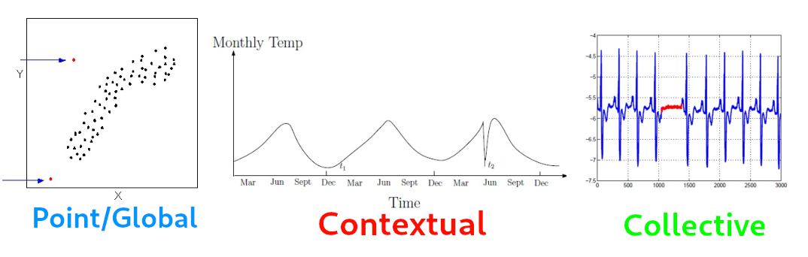

#### Intended output

- Dar uma label/value => identificar normal ou outlier instance;
- Dar um score - probabilidade de ser outlier:
  - Permite output ser ranked;
  - Requer especificar um threshold.

#### Learning task

- **Unsupervised Outlier Detection** - caso mais comum:
  - Dataset não tem informação sobre o comportamento de cada instância;
  - Assume que instâncias com comportamento normal são muito mais comuns.
- **Semi-supervised Outlier Detection:**
  - Dataset tem **poucas** instâncias de normal ou outlier behaviour;
  - E.g. fault detection.
- **Supervised Outlier Detection:**
  - Dataset tem instâncias de normal e outlier behaviour;
  - Difícil obter data assim em real-life applications.

#### Performance metrics

- Metricas de performance standard (e.g. accuracy, error rate) assumem que todas
  as instâncias são igualmente relevantes para a performance do modelo;
- Estas métricas dariam um boa estimativa de performace para um model que
  funciona bem em normal (frequent) cases e mal em outlier (rare) cases.

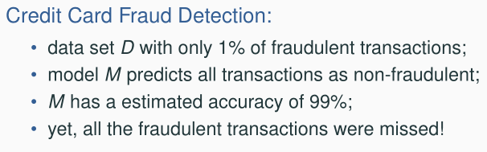

### Outlier detection approaches

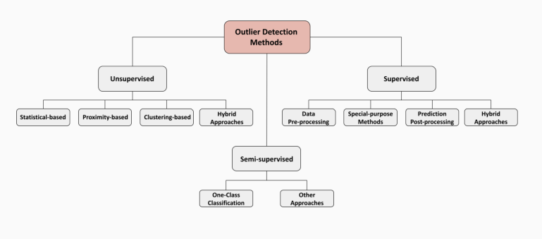

#### Unsupervised learning techniques

- **Statistical-based outlier detection:**
  - **Proposal** - todos os pontos que satifazem um statistical discordance test
    para um modelo são outliers;
  - **Advantages** - Se as assumptions do modelo forem verdade, estas tecnicas
    dão uma solução justificável para outlier detection. O score é associado ao
    confidence interval;
  - **Disadvantages** - A data nem sempre segue um modelo estatistíco. Escolher
    a melhor hypothesis não é straightforward. Capturar interações entre
    atributos nem sempre é possível. Estimar parámetros para alguns modelos
    estatisticos é difícil;
  - **Techniques** - Parametric (Grubbs' Test + Boxplot + Mahalanobis
    distance) + Non-parametric (Histograms + Kernel functions).
- **Proximity-based outlier detection:**
  - **Proposal** - normal instances occur in dense neighborhoods, while outlier
    occur far from their closest neighbors;
  - **Advantages** - Purely data driven technique. Não assume nada sobre a
    distribuição da data;
  - **Disadvantages** - Dificil distinguir true outlier e low-density noisy
    regions. Métodos têm de combinar global e local analysis. In high
    dimensional data, o contrast de distâncias é perdido. Computacionalmente
    complexo;
  - **Techniques** - Distance-base (euclidean distance) + Density-based (LOF);
  - Distance based techs não são boas a lidar com regiões de densidades
    diferentes => density-based têm em conta a densidade à volta de um outlier.

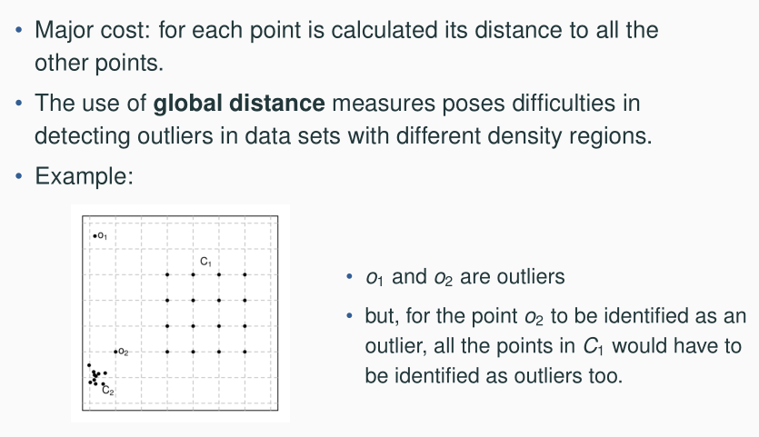

- **Clustering-based outlier detection:**
  - **Proposal** - Normal instances estão em clusters grandes e densos. Outliers
    são instances que não pertencem a nenhum dos clusters/estão longe do cluster
    mais próximo/formam clusters muito pequenos de densidade baixa;
  - **Advantages** - Easily adaptable to on-line/incremental mode. Test phase is
    fast;
  - **Disadvantages** - Training phase pesada. Se normal points não criarem
    clusters, esta técnica pode falhar. In high dimensional spaces, clustering
    algorithms may not give any meaningful clusters. Algumas tecnicas detetam
    outlies como by-product => não estão focadas nessa tarefa;
  - **Techniques** - DBSCAN + FindCBLOF + $OR_H$.
- **Isolation Forest** - deteta outliers puramente através do conceito de
  isolamento (sem medidas de distância ou densidade):
  - **Isolation** - separar uma instância do resto das instâncias;
  - **1st (training)** - criar um ensemble de random binary decision tree
    (isolation trees) usando sub-samples da training set;
  - **2nd (evaluation)** - passa as instâncias de teste pelas isolation trees
    para um obter um outlier score para cada instância;
  - **Score** - é a average path length. Outliers têm maior chance de ficar
    isolados junto à root. Normal points ficam isolados nos deeper levels;
  - **Advantages** - No distance/density measures. Elimina custo computacional
    do cálculo de distâncias. Scales up to handle extremely large data size and
    high-dimensional problems with a large number of irrelevant attributes;
  - **Disadvantages** - Hyperparameters têm de ser tuned. Runs diferentes podem
    dar resultados diferentes (randomness component). Large sample sizes may
    cause masking or swamping.

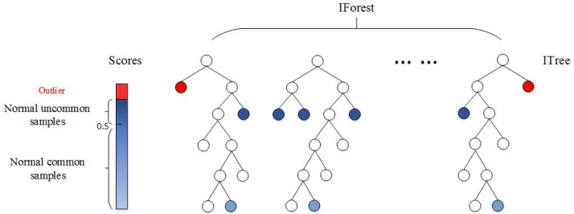

#### Semi-supervised learning techniques

- **One class classification:**
  - **Proposal** - Construir um prediction model para o comportamento normal e
    classificar todos os desvios como outliers;
  - **Advantages** - Modelos são interpretáveis. Normal behaviour pode ser
    aprendido accurately. Pode detetar novos outliers que não aparecem perto de
    outros outliers no treino;
  - **Disadvantages** - Precisa de labels de normal/outlier. Possivelmente alto
    false alarm rate (dados normais não vistos em treino podem ser classificados
    como outliers);
  - **Techniques** - Auto-associative neural network + One-class SVM.

### Contextual outlier detection

- **Proposal** - se uma data instance é um outlier num dado contexto (mas não
  otherwise), então é um **contextual outlier**;
- Cada instancia é definida usando 2 sets de atributos:
  - **Contextual attributes** - usados para determinar o contexto (vizinhança)
    da instância:
    - Sequential context - position + time;
    - Spatial context - latitude + longitude;
    - Graph context - weights + edges.
  - **Behavioural attributes** - which define the non-contextual characteristics
    of an instance.
- O comportamento dos outliers é determinado usando os behavioural attributes de
  um contexto específico;
- **Advantages:**
  - Permite uma definição natural de outlier em muitas real-life applications;
  - Detects outliers that are hard to detect when analysed in the global
    context.
- **Disadvantages:**
  - Temos de identificar um set de bons contextual attributes;
  - Assume que todas as instâncias normais num contexto serão similares (em
    termos de behavioural attributes), enquanto outliers são diferentes.
- **Techniques:**
  - Reduction to point outlier detection;
  - Utilizing structure in data.

### Collective outlier detection

- **Proposal** - se uma coleção de instâncias relacionadas é anómala em todo o
  data set => **collective outlier**. As instâncias podem não ser outliers por
  si só mas a sua ocorrência junta é anómala;
- **Advantages:** - Permite uma definição natual de outlier em real-life
  applications em que as data instances estão relacionadas;
- **Disadvantages:**
  - Contrary to contextual outlier, structures are often not explicitly defined
    => have to be discovered;
  - Precisa de extrair features examinando estrutura do dataset;
  - Exploração de estruturas na data tipicamente usa heuristicas => application
    dependent;
  - Computational cost is high.
- **Techniques:**
  - Pode ser um **contextual outlier** se analisado num contexto;
  - Podem ser transformado num **contextual outlier** detection problem ao
    incorporar info do contexto.

### Outlier detection in High Dimensionality Data

- **Challenges:**
  - Interpretation of outliers;
  - Data sparsity;
  - Data subspaces;
  - Scalable with respect to dimensionality.
- **Techniques:**
  - Find distance-based outliers, mas usar ranks de dist em vez de abs dist de
    outlier detection;
  - **Dimensionality reduction** - the principal components with low variance
    are preferred, because normal objects are likely close to each other and
    outliers often deviate from the majority;
  - Projetar data em vários subspaces para encontrar area onde densidade é muito
    mais baixa que a average;
  - Desenvolver novos modelos para high-dimensional outliers directly.

## Artificial Neural Networks (ANN)

- Set de unidades (**neurons**) conectadas. Estas conecções têm um **weights**;
- Cada unit tem um activation level;
- Algumas units estão conectadas ao mundo exterior => existem **input e output
  neurons**;
- Leaning em ANNs => update dos weights das conecções.

### Artificial neuron

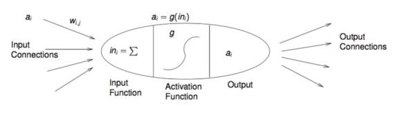

1. Linear combination dos inputs: $€_i = \sum_j{w_{ji} * a_j + b}$
2. Uma (tipicamente) não-linear activation function: $a_i = g(in_i)$

#### Activation functions

- Determinam o output de um nó na neural network:
  - linear;
  - non-linear - mais comuns porque **permitem o modelo generalizar/adaptar**
    com variedade de data.

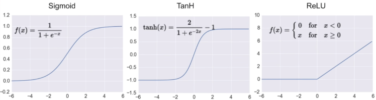

### Perceptron

Networks com uma input e uma output layer.

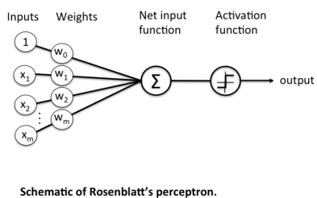

- A linear classifier for binary classification:
  - 1 se $w * x + w_0 > 0$
  - 0 otherwise.
- Aprende atualizando weights através da delta rule com leaning rate $n$;
- $w_i(t + 1) = w_i(t) + n(true - predicted)x_i$

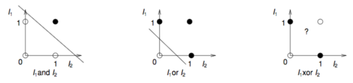

### Types of ANNs

#### Feed-forwards network (multilayer perceptrons)

- Network unidirecionais (conecções de input para output) e sem ciclos;
- Cada unidade só se conecta a unidades da camada seguinte;
- Unidades de uma layer nunca fazem conecções até unidades da layer anterior.

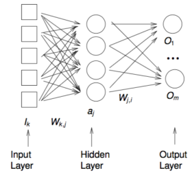

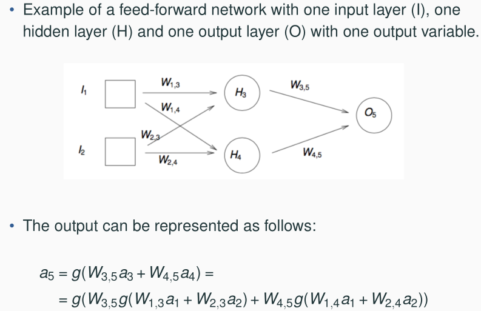

### Recurrent networks

- Networks com conecções arbitrárias;
- **Feedback effects** causam possível instabilidade e comportamento caótico;
- Usualmente demoram mais tempo a convergir.

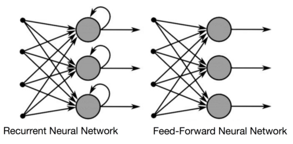

### Backpropagation algorithm (mais popular)

- Similar ao usado em perceptron networks;
- **Intuition:**
  - Cada unidade é responsável por uma fração do erro nos nós de output a que
    está conectada;
  - O erro é dividido de acordo com os pesos da conecção entre as hidden e
    output units respetivas => **propagating the errors backwards**.
- Computa o gradient em **weight space** de uma feedforwards neural network de
  acordo com a **loss function**;
- **Algoritmo:**
  - Inicializar weights (small random values);
  - Para cada exemplo no training set, até convergir (todos os exemplos são
    classificados corretamente ou satisfazemos o stopping criterion) fazer:
    - **Predict** output;
    - Calcular o **prediction error** com a **loss function**;
    - Computar $\delta_h$ para todos os weights desde a hidden layer até à
      output layer;
    - Computar $\delta_i$ para todos os weights deste da input layer até a
      hidden layer;
    - Update dos network weights.

#### Gradient descent

- **Stochastic gradient descent** - instead of calculating the gradient of the
  full function (dataset completo), we update the weights one example at a time;
- **Batch gradient descent** - batch size é o número de sub samples dadas à
  network apõs a qual o weight update acontece;
- Ambos são mais efetivos a **escapar de local minima**.

#### Stopping criteria

- **Too early** => risco de network ainda n trained;
- **Too late** => perigo de overfitting (adjustment to noise in the data).
- Maximum number of iterations;
- Error based on the training set: erro no training set estar abaixo de um certo
  limite;
- Error based on validation set (independente do training set): erro no
  validation set chegou a um minimo.

### Issues

- Nº de nós na hidden layer:
  - **Few nodes** => underfitting;
  - **Many nodes** => overfitting;
  - **Não há critério** para definir nº de nós na hidden layer.
- Effect of learning rate (size of the steps to obtain the direction of maximum
  descent):
  - **Small** => higher learning times;
  - **High** => pode não convergir.

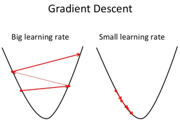

- Generalization vs. Specialization trade-off:
  - **Optimal nº of hidden neurons:**
    - Too many hidden neurons => overfitting (training set is memorized),
      network useless em novos data sets;
    - Not enough hidden neurons => network unable to learn problem concept.
  - **Overtraining** - too many examples. The ANN memorizes the examples instead
    of the general idea.

### Hyperparameters

- **Network structure:** nº de layers, nº de neurons em cada layer, weights
  initialization, activation function;
- **Training algorithm:** learning rate, nº de epochs (**iterations**), early
  stopping criterion, weight decay (**regularization**).

### Tips

- Features com distribuiçoes de valores muito diferentes não são convenientes
  (dadas as tipical activation functions);
- Missing values em input features podem set representados como **0** => não
  influencia o training process;
- Output em multiclass setting:
  - Use one-hot encoding, there are M output neurons (1 per class);
  - For each case, the class with the highest probability value.
- Weights inicias random na gama [-0.05, 0.05];
- Shuffle the training set entre epochs;
- Learning rate deve começar com um high value que decresce progressivamente;
- Treinar a network várias vezes usando initialization weights diferentes.

### Wrap-up

- Input is high-dimensional discrete or real-valued;
- Output is discrete or real value:
  - **Classification** - use Softmax func as activation func in output layer to
    compute the prob para as classes;
  - **Regression** - use a linear function as activation func in output layer.
- Output é um vector de vals;
- Possibly noisy data;
- Form of target function is unknown;
- Human readability of result is unimportant.

### Pros

- Telerance of noisy data;
- Ability to classify patterns on which they have not been trained;
- Successful on a wide range of real-world problems;
- Algorithms are inherently parallel.

### Cons

- Long training times;
- Resulting models are essentially black boxes.

## Deep learning - Convolution Neural Networks (CNN)

- Múltiplas hidden layers;
- Feedforward neural networks;
- Neurons typically use ReLU or sigmoid activation funcs;
- Weight multiplication are replaced by convolution (filters);
- Pode set aplicado a raw signal (sem computar ad hoc features) => features are
  learnt automatically.

### Convolution

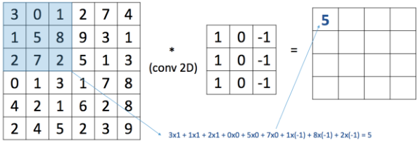

- Segunda matriz é um **filtro**;
- **Filtro** é overlapped para cada pos da primeira matriz;

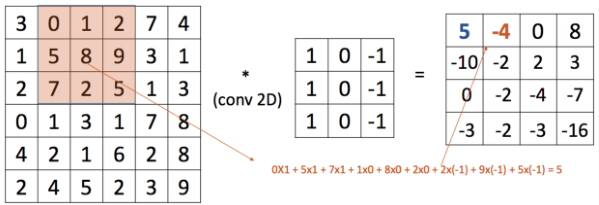

### The good

- Reduced amount of parameters to learn (local features);
- More efficiente than dense multiplication;
- Specifically thought for images or data with grid-like topology;
- Convolution layers are equivariant to translation;

### The bad

- Não resolve todos os problemas/não o melhor para todos os problemas;
- Difficult to select best architecture for a problem;
- Require new training for each task/configuration;
- Requer um training set muito grande;
- Não se sabe pk funciona bem => unstable contra adversarial examples.

## Ensemble

- Multiple models (**base models**) obtidos por aplicar um learning process a um
  problema;
- Modelos são combinados para fazer prediction (tentam melhorar model quality).

### Vantagens

- **Accuracy** - majority compensa erros individuais;
- **Diversity is key** - Individual models specialize in different areas do data
  space.

### Desvantagens

- **Complexity:**
  - Understanding global model;
  - Explaining decisions;
  - Computationally expensive.
- **Occam's Razor:**
  - De **entre hipoteses de uma prediction**, escolher a que faz menos
    assumptions;
  - Simplicity leads to greater accuracy;
  - Identificar o melhor modelo requer identificar a proper "model complexity".

### Types of ensembles - gerar models

- **Homogeneous** - single induction algorithm;
- **Heterogeneous** - multiple induction algorithms.

### Types of ensembles - combine models

- **Regression:** **avg**, **weighted avg**, sum, weighted sum, product,
  maximum, minimum, median;
- **Classification:** **majority voting**, **weighted majority voting**, borda
  count;
- **Borda count:**
  - Base models rank candidates in order of preference;
  - Points assigned to eahc position;
  - Prefiction is class with more points.

### Bagging

- Dividir dataset em partes;
- Cada classificador é treinado com uma parte do dataset;
- **Prediction** - average/majority;
- **Vantagens:**
  - **Accuracy** - oftern significativamente melhor que um único classifier;
  - Robust to noise.
- **Desvantagens:**
  - **Unstable classifier** - changes pequenos na training data pode levar a
    major decision changes. E.g. dt e nn;

### Boosting

- Treinar um modelo $M_1$;
- Ver os exemplos mal predicted e dar-lhes mais weight ao treinar modelo
  $M_{i + 1}$;
- Prediction é um agregar dar predictions dos vários modelos **dando mais peso
  aos modelos baseado na sua accuracy**.
- **Prediction** - weighted vote;
- **Vantages:**
  - Independent sampling (vs. error-dependent sampling do bagging);
  - Uniform aggregation (vs. weighted aggregation do bagging);
  - => Costuma ter melhor accuracy.
- **Desvantagens:**
  - Risk de overfitting do modelo para misclassified data.

### Random forest

- Treinar k modelos com um random subset dos features originais para gerar cada
  árvore;
- **Prediction** - average/majority;
- RF vs Adaboost:
  - Comparable em accuracy;
  - Mais robusto a erros e outliers.
- RF vs Bagging & adaboost:
  - RF é insensível ao número de atributos selecionados para cada split;
  - Faster.

### Negative correlation learning

- Treinar k modelos para minimizar a **error function** do ensemble:
  - Adiciona à error function uma penalty com o avg error dos modelos já
    treinados.
- **Prediction** - average;
- Apenas em regression - algoritmos que tentam minimizar/maximizar uma função
  objetivo (e.g. nn, svr);
- Modelos negativamente correlacionados com o avg err dos modelos anteriores.

## Metalearning and autoML

- **Many models** - podemos chegar ao ponto de ter um prediction model para cada
  cliente;
- Bias no dataset e learning algortimo => nem todos os algoritmos conseguem
  fazer tudo. **Bias-free learning is futile**;
- **Bias** é o critério para preferir um modelo a outro;
- **Metalearning** - metadata (meta atributos) para selecionar melhor algortimo;
- **Responsible AI** - Promoting fair models => sacrifice predictive
  performance.
